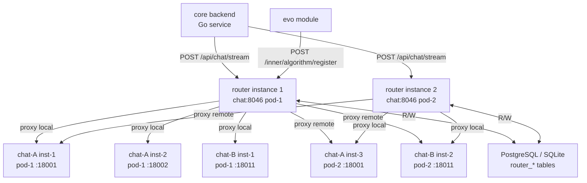
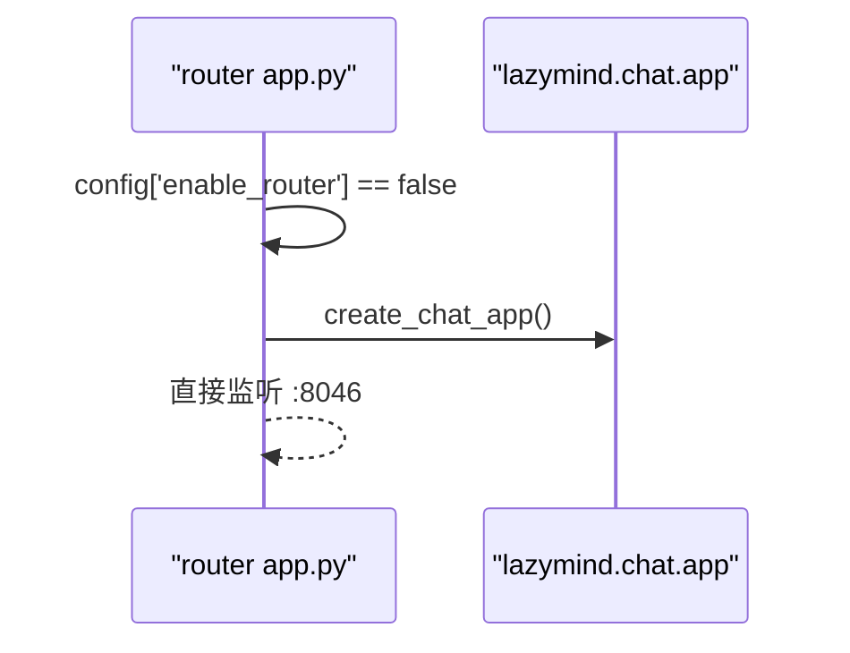
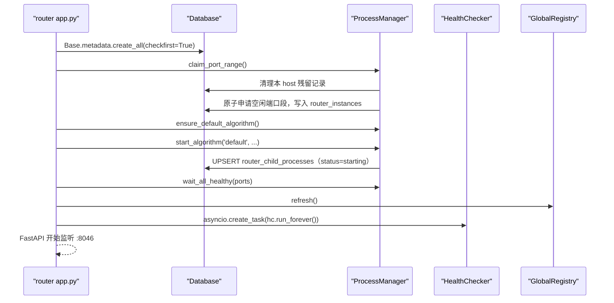

# LazyMind Router 模块设计方案

## 概述

新增 `router` 模块**替换**现有 `chat` 容器（Docker Compose service 名保持 `chat`，端口保持 `8046`，对 `core` backend 完全透明），作为 chat 子服务的管理层和流量代理层。支持多算法版本并行运行、动态 AB 测试分流、子进程健康探活与自动重启，并为 evo（算法跃迁）模块提供注册接口。

通过 `LAZYMIND_ENABLE_ROUTER` 环境变量控制是否启用 router 模式。关闭时 `app.py` 退化为原始 chat 服务，所有 router 功能不启动，行为与改造前完全一致。

---

## 1. 技术选型

**Python + FastAPI**，理由：

- chat 子服务是 Python/FastAPI，router 以子进程方式启动它，共享同一语言和启动入口
- 流式转发（SSE）在 Python `httpx` + FastAPI `StreamingResponse` 中有成熟范式
- evo 模块是 Python，调用注册接口可以直接在同语言内完成
- asyncio 足够处理 IO 密集型的代理并发场景

**为什么不挂载 Docker Socket**：技术上可行，但不选择，原因如下：

- 挂载 `/var/run/docker.sock` 等同于给容器宿主机 root 权限，生产环境安全风险高
- evo 修改的是运行时 Python 文件（volume mount 路径下），`docker run` 新容器仍需通过 volume 传代码，绕了一圈回到原点
- K8s 下 Docker Socket 不存在（containerd 时代），迁移需完全重写
- 子进程模式通过 `PYTHONPATH` 直接加载不同路径的代码，`localhost:port` 通信无额外网络配置，K8s Pod 内同样有效

---

## 2. 能力边界

### 做什么

- 接收来自 `core` backend 的 `/api/chat/stream` 请求，完整透明代理给 chat 子进程
- 管理 1-N 个"算法版本"，每个版本对应一个代码路径，可在本 Pod 内启动 1-M 个子进程实例
- 通过 `router_instances` 表发现其他 router 实例管理的子进程，跨实例路由请求
- 通过 `router_child_processes` 表感知所有子进程（包括其他实例管理的）的健康状态
- 根据 AB 策略（权重随机）将请求分配到指定算法版本，从全局健康实例中选取
- 支持调用方在请求中直接指定 `algorithm_id`，此时绕过分流策略
- 对**本实例管理的**子进程做周期性健康探活，失败时自动退避重启；通过共享表感知其他实例子进程的健康状态
- 提供 API 供 evo 模块注册/注销算法版本、动态更新 AB 策略
- 将 AB 策略持久化到数据库（多 router 实例共享）
- 在响应 header 中注入 `X-Algorithm-Id` 供上层追踪和 session 粘性
- 启动时自动从 `router_instances` 表申请端口范围，无需手动配置

### 不做什么

- 不管理 Docker 镜像的构建和拉取
- 不做算法内多实例之间的加权负载均衡（只做简单 round-robin）
- 不修改 chat 子服务任何代码
- 不持久化聊天内容（由 core 负责）
- **不维护 session→algorithm 绑定**（由调用方持有，见 §8.4）
- 不接管其他 router 实例挂掉后遗留的子进程（子进程随其 router 实例一起消失，重启后恢复）

---

## 3. 架构图



**关键点**：

- 每个 router 实例只负责**启动和重启**本 Pod 内的 chat 子进程；但路由时从 `router_child_processes` 表读取**全局所有健康实例**（含其他 Pod 的），按 round-robin 选择目标，实现跨实例负载均衡
- 端口分配：router 启动时在 `router_instances` 表中原子地申请一段端口范围，无需手动配置
- AB 策略、子进程状态全部存数据库，多实例天然共享
- 跨 Pod 路由依赖 K8s overlay 网络（Pod IP 互通）；子进程需绑定 `0.0.0.0` 才能被其他 Pod 访问

---

## 4. `enable_router` 模式切换

通过环境变量 `LAZYMIND_ENABLE_ROUTER`（默认 `false`）控制启动模式。`app.py` 是统一入口，启动时读取此配置项决定走哪条路径：

```
LAZYMIND_ENABLE_ROUTER=false（默认）
  └─ 直接启动原始 chat FastAPI 应用（lazymind.chat.app.create_app()）
     完全等同于改造前，无任何 router 逻辑

LAZYMIND_ENABLE_ROUTER=true
  └─ 启动 router 模式：ProcessManager + GlobalRegistry + HealthChecker + AB 路由
     /inner/* 管理接口全部可用
```

`app.py` 核心逻辑：

```python
from lazymind.config import config
import lazymind.router.config  # registers router config keys

def create_app() -> FastAPI:
    if not config['enable_router']:
        from lazymind.chat.app import create_app as create_chat_app
        return create_chat_app()
    # router 模式
    ...

app = create_app()
```

**退化模式的行为**：

- 不建 `router_*` 数据表，不申请端口范围，不启动子进程
- 不启动 `HealthChecker` 和 `GlobalRegistry` 后台任务
- `/inner/*` 路由全部不注册，返回 404
- `GET /health`、`POST /api/chat/stream` 行为与原始 chat 完全相同

**Docker Compose 中的用法**：

```yaml
chat:
  command: python -m lazymind.router.app --port 8046
  environment:
    - LAZYMIND_ENABLE_ROUTER=${LAZYMIND_ENABLE_ROUTER:-false}
    - LAZYMIND_ROUTER_PORT_POOL_START=18000
    - LAZYMIND_ROUTER_PORT_POOL_END=18999
    - LAZYMIND_ROUTER_PORTS_PER_INSTANCE=100
    - LAZYMIND_ROUTER_DEFAULT_ALGO_PATH=/opt/lazymind/chat
    - LAZYMIND_ROUTER_DEFAULT_INSTANCE_COUNT=1
    - LAZYMIND_CORE_DATABASE_URL=postgresql://...
  volumes:
    - ./algorithm/lazymind:/opt/lazymind
    - ./data/core/uploads:/var/lib/lazymind/uploads
```

默认 `LAZYMIND_ENABLE_ROUTER=false`，与改造前行为完全一致。需要 AB 测试时在 `.env` 中设置 `LAZYMIND_ENABLE_ROUTER=true` 即可。

---

## 5. Docker Compose 集成

`docker-compose.yml` 中**将原 `chat` service 替换为 router**，service 名保持 `chat`，端口保持 `8046`，`core` backend 的 `LAZYMIND_CHAT_SERVICE_URL=http://chat:8046` **完全不变**，无需任何 backend 改动。

router 模式启动时自动将 `LAZYMIND_ROUTER_DEFAULT_ALGO_PATH` 所指路径注册为 `id=default` 的算法并启动子进程。默认算法没有特殊地位，可以和其他算法一样被下线。

---

## 6. 配置项

所有配置通过 `lazymind.config` 注册，在使用处直接 `config['xxx']` 读取，不导出模块级常量。`router/config.py` 仅负责 `config.add(...)` 注册。

| 配置 key | 环境变量 | 类型 | 默认值 | 说明 |
|---|---|---|---|---|
| `enable_router` | `ENABLE_ROUTER` | bool | `false` | 是否启用 router 模式 |
| `router_port_pool_start` | `ROUTER_PORT_POOL_START` | int | `18000` | 端口池起始 |
| `router_port_pool_end` | `ROUTER_PORT_POOL_END` | int | `18999` | 端口池结束（含） |
| `router_ports_per_instance` | `ROUTER_PORTS_PER_INSTANCE` | int | `100` | 每个 router 实例申请的端口数 |
| `router_default_algo_path` | `ROUTER_DEFAULT_ALGO_PATH` | str | `/opt/lazymind/chat` | 默认算法代码路径 |
| `router_default_instance_count` | `ROUTER_DEFAULT_INSTANCE_COUNT` | int | `1` | 默认算法启动实例数 |
| `router_health_interval` | `ROUTER_HEALTH_INTERVAL` | int | `10` | 健康探活间隔（秒） |
| `router_health_max_failures` | `ROUTER_HEALTH_MAX_FAILURES` | int | `3` | 连续失败次数触发重启 |
| `router_heartbeat_interval` | `ROUTER_HEARTBEAT_INTERVAL` | int | `10` | 实例心跳更新间隔（秒） |
| `router_instance_timeout` | `ROUTER_INSTANCE_TIMEOUT` | int | `30` | 心跳超时判定死亡（秒） |
| `router_registry_refresh_interval` | `ROUTER_REGISTRY_REFRESH_INTERVAL` | int | `5` | 全局实例视图刷新间隔（秒） |
| `router_startup_timeout` | `ROUTER_STARTUP_TIMEOUT` | int | `30` | 子进程启动健康等待超时（秒） |
| `core_database_url` | `CORE_DATABASE_URL` | str | — | 数据库 URL（router 模式必填） |
| `router_host` | `ROUTER_HOST` | str | — | 对外广播的 host（未设置时自动检测） |

`resolve_host()` 函数（`router/config.py`）负责解析对外广播的 host：优先 `router_host` 配置 → `POD_IP` / `MY_POD_IP` 环境变量 → `socket.gethostname()`。

---

## 7. 数据表设计

**初始化方式**：在 `router/db/models.py` 中用 SQLAlchemy ORM 定义表，在 `router/app.py` 启动时调用 `Base.metadata.create_all(engine, checkfirst=True)` 自动建表。

**数据库兼容**：同时支持 PostgreSQL 和 SQLite。`db/client.py` 根据 URL 前缀自动选择驱动（`postgresql+asyncpg` / `sqlite+aiosqlite`）。ORM 使用通用 `JSON` 类型（非 PG 专有 `JSONB`），时间戳使用 Python `datetime` 写入（非 SQL 内嵌 `NOW()` / `INTERVAL`）。

共 **4 张表**：

### `router_algorithms` — 算法版本注册表

```sql
CREATE TABLE router_algorithms (
    id           VARCHAR(64) PRIMARY KEY,
    name         VARCHAR(255) NOT NULL,
    code_path    VARCHAR(512) NOT NULL,
    config       JSON NOT NULL DEFAULT '{}',
    status       VARCHAR(32) NOT NULL DEFAULT 'starting',  -- starting/active/disabled
    created_at   TIMESTAMPTZ NOT NULL DEFAULT NOW(),
    updated_at   TIMESTAMPTZ NOT NULL DEFAULT NOW()
);
```

### `router_ab_strategies` — AB 分流策略

```sql
CREATE TABLE router_ab_strategies (
    id          SERIAL PRIMARY KEY,
    weights     JSON NOT NULL,          -- {"algo_v1": 70, "algo_v2": 30}
    is_active   BOOLEAN NOT NULL DEFAULT TRUE,
    created_at  TIMESTAMPTZ NOT NULL DEFAULT NOW(),
    updated_at  TIMESTAMPTZ NOT NULL DEFAULT NOW()
);
-- 仅一条 is_active=true 的记录为当前策略；更新时旧策略标记 is_active=false，插入新行
```

### `router_instances` — router 实例注册与端口池协调

```sql
CREATE TABLE router_instances (
    instance_id      VARCHAR(64) PRIMARY KEY,
    host             VARCHAR(255) NOT NULL,
    pid              INTEGER NOT NULL,
    port_range_start INTEGER NOT NULL UNIQUE,
    port_range_end   INTEGER NOT NULL,
    last_heartbeat   TIMESTAMPTZ NOT NULL DEFAULT NOW()
);
```

### `router_child_processes` — 子进程注册表（全局可见）

```sql
CREATE TABLE router_child_processes (
    id             SERIAL PRIMARY KEY,
    instance_id    VARCHAR(64) NOT NULL REFERENCES router_instances(instance_id),
    algorithm_id   VARCHAR(64) NOT NULL REFERENCES router_algorithms(id),
    host           VARCHAR(255) NOT NULL,
    port           INTEGER NOT NULL,
    pid            INTEGER,
    status         VARCHAR(32) NOT NULL DEFAULT 'starting',
    failures       INTEGER NOT NULL DEFAULT 0,
    last_health_at TIMESTAMPTZ,
    updated_at     TIMESTAMPTZ NOT NULL DEFAULT NOW(),
    UNIQUE (host, port)
);
CREATE INDEX ON router_child_processes (algorithm_id, status);
CREATE INDEX ON router_child_processes (instance_id);
```

**关键设计**：每个 router 实例只写自己管理的子进程记录，但所有 router 实例都读全表来构建全局健康实例视图，从而实现跨实例路由。

---

## 8. 模块结构

```
algorithm/lazymind/router/
├── __init__.py
├── app.py                        # 统一入口：enable_router 分支 + lifespan 管理
├── config.py                     # config.add() 注册所有配置项 + resolve_host()
├── api/
│   ├── proxy_routes.py           # 透明代理 /api/chat/stream
│   ├── algorithm_routes.py       # 算法版本 CRUD + 注册接口（供 evo 调用）
│   ├── strategy_routes.py        # AB 策略读写
│   ├── diagnostics_routes.py   # /inner/status 诊断接口
│   └── health_routes.py          # /health
├── core/
│   ├── registry.py               # GlobalRegistry：全局实例视图（内存缓存）
│   ├── process_manager.py        # ProcessManager：本实例子进程生命周期
│   ├── health_checker.py         # HealthChecker：探活 + 退避重启 + 心跳 + 死亡清理
│   ├── ab_router.py              # ABRouter：分流决策（显式指定 / 加权随机 / default）
│   └── stream_proxy.py           # StreamProxy：httpx 流式转发
└── db/
    ├── client.py                 # DB 连接（自动适配 PG / SQLite）
    └── models.py                 # SQLAlchemy ORM 模型（4 张表）
```

---

## 9. 关键类和函数

### `core/registry.py` — `GlobalRegistry`

负责构建和维护全局子进程视图（本地内存缓存，定期从 DB 刷新）：

```python
class ChildProcessInfo:
    instance_id: str
    algorithm_id: str
    host: str
    port: int
    status: Literal['starting', 'healthy', 'unhealthy', 'stopped']
    failures: int

    @property
    def url(self) -> str:
        return f'http://{self.host}:{self.port}'

class GlobalRegistry:
    _global_instances: dict[str, list[ChildProcessInfo]]  # algo_id -> 全局实例列表
    _rr_cursors: dict[str, int]                           # algo_id -> round-robin 指针

    async def refresh(self) -> None
        # SELECT * FROM router_child_processes WHERE status = 'healthy'

    def get_healthy_instance(self, algorithm_id: str) -> ChildProcessInfo | None
        # round-robin 选择

    def evict_instance(self, host: str, port: int) -> None
        # 立即从内存缓存摘除指定实例（健康探测失败时调用，不等 DB 刷新）
```

### `core/process_manager.py` — `ProcessManager`

只管理本实例（本 Pod）内的子进程：

```python
class ProcessManager:
    _instance_id: str          # UUID，启动时生成
    _host: str                 # resolve_host()
    _port_range: tuple[int, int]
    _next_port: int

    async def claim_port_range(self) -> tuple[int, int]
        # 1. 清理本 host 的所有历史残留记录（crash 重启后立即回收）
        # 2. 在 router_instances 表中找到未被占用的端口段并 INSERT

    async def start_algorithm(self, algo_id, code_path, count) -> list[int]
        # subprocess.Popen('python -m lazymind.chat.app --port {port}')
        # UPSERT router_child_processes（status=starting）

    async def restart_instance(self, host, port) -> None
        # kill 旧进程 → 同一 port 重新 spawn → UPSERT DB 记录

    async def shutdown(self) -> None
        # graceful：kill 所有子进程 + 删除本实例的 child_processes 和 instances 记录
```

### `core/health_checker.py` — `HealthChecker`

四个并行后台循环，任一崩溃后 5s 自动重建：

```python
class HealthChecker:
    async def run_forever(self) -> None:
        # 监督循环：health-probe / heartbeat / registry-refresh / cleanup-dead
        # 任一子 task 异常退出 → 等 5s → 重建该 task，其他 task 不受影响

    # 1. health-probe（每 router_health_interval 秒）
    #    对本实例子进程 GET http://127.0.0.1:{port}/health
    #    第一次失败 → 立即 registry.evict_instance() 摘除，停止向其转发流量
    #    连续失败 router_health_max_failures 次 → 标记 unhealthy → 退避重启
    #    重启成功 → 立即 registry.refresh() 恢复流量
    #    退避序列：1s → 2s → 4s → 8s → 16s → 32s → 60s

    # 2. heartbeat（每 router_heartbeat_interval 秒）
    #    更新 router_instances.last_heartbeat

    # 3. registry-refresh（每 router_registry_refresh_interval 秒）
    #    触发 GlobalRegistry.refresh()

    # 4. cleanup-dead（每 heartbeat_interval * 2 秒）
    #    删除 last_heartbeat 超过 router_instance_timeout 的实例及其子进程记录
```

### `core/ab_router.py` — `ABRouter`

分流决策优先级：

1. 请求中携带 `algorithm_id` → 直接使用
2. 当前激活策略的权重做加权随机选择
3. fallback → `default`

**不维护 session 绑定**。多轮对话一致性由调用方负责：首次请求拿到响应头 `X-Algorithm-Id`，后续请求在 body 中传入 `algorithm_id` 即可。

```python
class ABRouter:
    async def select_algorithm(
        self,
        caller_algorithm_id: str | None = None,
    ) -> str
```

### `core/stream_proxy.py` — `StreamProxy`

使用 `httpx.AsyncClient(timeout=None)` 转发完整请求体，逐 chunk `yield`，保持 `Content-Type: text/event-stream`。在响应 header 中注入 `X-Algorithm-Id` 和 `X-Instance-Host`。

### `api/proxy_routes.py` — 对外接口

```python
@router.post('/api/chat/stream')
async def proxy_chat_stream(request: Request):
    # 1. 解析 body 中的可选 algorithm_id
    # 2. ab_router.select_algorithm(caller_algorithm_id)
    # 3. global_registry.get_healthy_instance(algorithm_id)
    # 4. stream_proxy.forward(request, instance.url)
    #    响应 header 注入 X-Algorithm-Id
```

---

## 10. AB 策略管理

### 更新逻辑（`PUT /inner/ab/strategy`）

**全量替换**，不支持局部更新：

1. 校验所有 weight 值为正整数
2. 若 sum ≠ 100，自动 normalize 到 100（余数补到最大权重项）
3. 校验所有 algo_id 存在且 `status=active`
4. 将所有 `is_active=True` 的旧策略标记为 `is_active=False`
5. 插入新行 `is_active=True`

示例：`{"algo_v1": 1, "algo_v2": 1}` → normalize 为 `{"algo_v1": 50, "algo_v2": 50}`

### 选择逻辑（运行时）

```
SELECT ... WHERE is_active=True ORDER BY id DESC LIMIT 1
```

取最新 active 策略 → 过滤掉已 disabled / starting 的算法 → 过滤掉没有健康实例的算法 → `random.choices(population, weights=w, k=1)` 加权随机。

### Session 粘性（调用方职责）

router 不做 session 绑定。调用方实现多轮一致性的方式：

```
第一次请求（不带 algorithm_id）
  → router 按 AB 策略抽签
  → 响应 header: X-Algorithm-Id: algo_v2

后续请求（body 带 algorithm_id: "algo_v2"）
  → router Priority 1 直接使用，不经过随机
```

---

## 11. 全部 API

### 对外（`core` backend 调用，与现有 chat 完全兼容）

| 方法 | 路径 | 描述 |
|---|---|---|
| `GET` | `/health` | 健康检查 |
| `GET` | `/api/health` | 同上，兼容现有 health_routes |
| `POST` | `/api/chat/stream` | 流式对话。body 与现有 chat_routes 完全相同，**额外增加可选字段 `algorithm_id: str`**（传入时绕过 AB 策略）；response header 注入 `X-Algorithm-Id` |

### 算法版本管理（`/inner/algorithm/*`，供 evo 和运维调用）

| 方法 | 路径 | 关键参数 | 描述 |
|---|---|---|---|
| `POST` | `/inner/algorithm/register` | `id?`, `name`, `code_path`, `instance_count=1`, `config={}` | 写 DB（status=starting）+ 启动子进程，全部健康后置 status=active 并返回端口列表 |
| `DELETE` | `/inner/algorithm/{algorithm_id}` | path: `algorithm_id` | 停止该算法所有子进程，标记 DB status=disabled（记录保留用于审计） |
| `GET` | `/inner/algorithm` | — | 列出所有算法版本（id/name/status/config，不含实例列表） |
| `GET` | `/inner/algorithm/{algorithm_id}` | path: `algorithm_id` | 查询单个算法版本详情（含全局实例列表） |
| `POST` | `/inner/algorithm/{algorithm_id}/restart` | path: `algorithm_id` | 重启本节点上该算法的所有子进程 |

### AB 策略管理（`/inner/ab/*`）

| 方法 | 路径 | 关键参数 | 描述 |
|---|---|---|---|
| `PUT` | `/inner/ab/strategy` | `weights: dict[str, int]`（正整数，自动 normalize 到 sum=100） | 全量更新当前激活策略 |
| `GET` | `/inner/ab/strategy` | — | 查询当前策略 |
| `DELETE` | `/inner/ab/strategy` | — | 清空策略（流量回落到 `default`） |

### 状态与诊断（`/inner/*`）

| 方法 | 路径 | 描述 |
|---|---|---|
| `GET` | `/inner/status` | 本实例完整状态：instance_id、端口范围、本实例子进程列表、全局子进程摘要、当前 AB 策略 |

---

## 12. 启动流程

### `enable_router=false`（退化模式）



### `enable_router=true`（router 模式）



---

## 13. 故障处理

### 算法子进程意外退出

| 阶段 | 行为 |
|---|---|
| 探测失败（第 1 次） | 立即 `registry.evict_instance()` 从内存摘除，停止转发流量；DB status 不变，仅更新 failures 计数 |
| 连续失败达阈值（默认 3 次 × 10s） | 标记 DB `status=unhealthy`，调度退避重启（同一 port） |
| 重启成功 | 立即 `registry.refresh()` 恢复流量；DB 记录 UPSERT（覆盖原行，不产生新行） |
| 重启失败 | 继续退避重试，退避上限 60s |

### router 进程意外退出

| 退出方式 | 数据表清理 | 恢复时间 |
|---|---|---|
| graceful shutdown（SIGTERM） | `ProcessManager.shutdown()` 删除本实例的 child_processes + instances 记录 | 立即 |
| crash / SIGKILL / OOMKill | 不清理，残留记录留在 DB | 下次 startup 时 `claim_port_range()` 主动按 host 清理残留；其他 pod 的 cleanup 循环也会在 30s 后清除 |

### health checker task 崩溃

`run_forever()` 内置监督循环：任一子 task 异常退出后等 5s 自动重建，其他 task 不受影响。顶层 `health-checker` task 加了 `done_callback`，崩溃时打 `CRITICAL` 日志。

---

## 14. 分布式策略说明

| 能力 | 方案 |
|---|---|
| 多 router 实例共享 AB 策略 | 存 `router_ab_strategies` 表，所有实例读同一条 active 记录 |
| Session 粘性 | **不由 router 维护**。调用方保存 `X-Algorithm-Id` 响应头，后续请求传入 `algorithm_id` |
| 端口范围自动申请 | 启动时在 `router_instances` 表原子 INSERT 空闲端口段（`port_range_start` UNIQUE 约束 + retry loop，防并发冲突） |
| 跨实例子进程发现 | 所有子进程状态写 `router_child_processes` 表，任意 router 读全表构建全局视图 |
| 跨 Pod 路由 | `host` 字段存 Pod IP（`resolve_host()`），K8s overlay 网络下 Pod 间 L3 互通；子进程需 bind `0.0.0.0` |
| 感知其他实例子进程健康状态 | 各子进程的属主 router 负责更新 status；其他实例通过 `GlobalRegistry.refresh()` 读取；探测失败时 `evict_instance()` 立即摘除 |
| 死亡实例清理 | startup 时按 host 主动清理残留；运行时 `cleanup-dead` 循环删除 heartbeat 超时实例 |
| crash 重启快速恢复 | `claim_port_range()` 启动时立即清理本 host 所有历史记录，不等心跳超时 |
| **不做**：故障实例子进程接管 | router 挂掉后子进程随之消失；重启后 router 自动重建 |

---

## 15. 与现有模块的复用关系

| 现有代码 | 复用方式 |
|---|---|
| `lazymind.chat.app` | `ProcessManager` 以子进程方式启动 `python -m lazymind.chat.app` |
| `backend/core/chat/chat.go` 中 `ChatServiceEndpoint()` | `LAZYMIND_CHAT_SERVICE_URL=http://chat:8046` 完全不变 |
| `lazymind.config` | router 复用同一套 `Config(prefix='LAZYMIND')` 机制，使用处直接 `config['xxx']` 读取 |

---

## 16. K8s 兼容性

子进程模式不依赖 Docker Socket，K8s Pod 内完全有效：

- 端口自动申请机制无需 K8s 侧配置，每个 Pod 独立申请端口段
- `ProcessManager` 未来可替换为调用 K8s API 启动 sidecar container，`GlobalRegistry` 接口不变
- `router_ab_strategies` 和 `router_child_processes` 存数据库，天然多副本共享
- `router_child_processes.host` 在 K8s 下填 Pod IP（通过 `POD_IP` 环境变量或 Downward API），跨 Pod 路由依赖 CNI overlay 网络
- 子进程启动命令应显式传 `--host 0.0.0.0`，确保其他 Pod 可通过 Pod IP 访问
