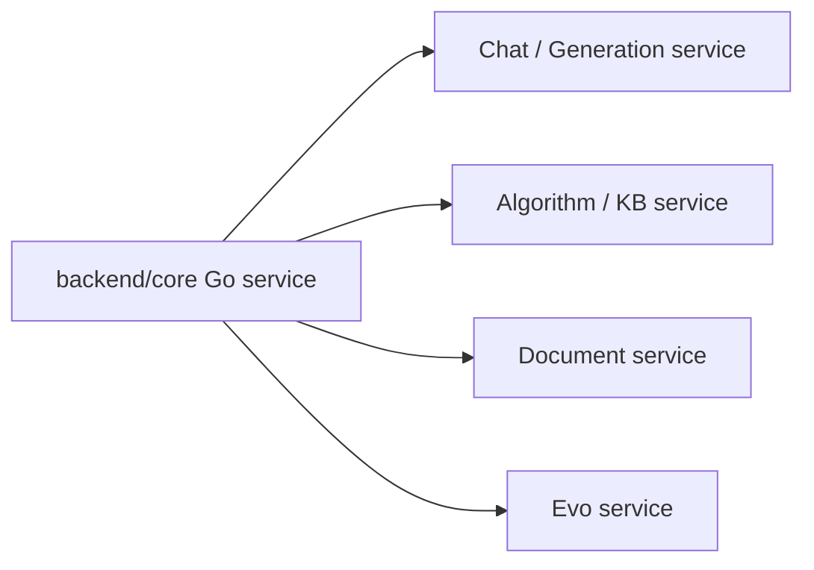

# Core 服务外部依赖扫描

生成日期: 2026-05-08

## 扫描范围

本次扫描以 Go 版 `backend/core` 服务为主，仅保留以下四类 Core 运行期外部服务:

- Chat / Generation 服务
- Algorithm / KB 服务
- Document 服务
- Evo Service

主要证据文件:

- `backend/core/common/external_endpoints.go`
- `backend/core/doc/*.go`
- `backend/core/chat/*.go`
- `backend/core/agent/*.go`
- `backend/core/modelprovider/check.go`
- `backend/core/algo/generate_client.go`
- `backend/core/wordgroup/*.go`
- `docker-compose.yml`

## 总览

| 外部服务 | 配置项 | 代码默认值 | docker-compose 默认值 | 主要用途 |
| --- | --- | --- | --- | --- |
| Chat / Generation 服务 | `LAZYMIND_CHAT_SERVICE_URL` | `http://chat:8046` | `http://chat:8046` | 对话、流式对话、技能/记忆/偏好生成、模型连通性检查 |
| Algorithm / KB 服务 | `LAZYMIND_ALGO_SERVICE_URL` | `http://10.119.24.129:8850` | `http://lazyllm-doc-server:8000` | 算法列表、算法分组、KB 创建/更新/删除、chunk 查询 |
| Document 服务 | `LAZYMIND_DOCUMENT_SERVICE_URL` | 回退到 `LAZYMIND_ALGO_SERVICE_URL` | `http://lazyllm-doc-server:8000` | 文档 add/reparse/transfer/delete、任务取消 |
| Evo Service | `LAZYMIND_EVO_SERVICE_URL` | `http://host.docker.internal:8048` | `http://evo-api:8047` | Agent 线程、自进化流程、结果、报告和 diff 代理 |

## 服务明细

### 1. Chat / Generation 服务

基础 URL 来自 `LAZYMIND_CHAT_SERVICE_URL`，代码默认 `http://chat:8046`。

Core 调用的端点:

| 方法 | 路径 | 用途 | 触发模块 |
| --- | --- | --- | --- |
| POST | `/api/chat` | 非流式问答 | `chat/conversation_logic.go`, `chat/chat.go` |
| POST | `/api/chat/stream` | 流式问答 | `chat/chat.go`, `chat/conversation_logic.go` |
| POST | `/api/chat/llm_generate` | 按 `task_type` 生成技能、记忆、用户偏好或润色 prompt | `algo/generate_client.go`, `skill/management.go`, `memory/handler.go`, `preference/handler.go` |
| POST | `/api/model/check` | 校验模型 provider/group 的连通性 | `modelprovider/check.go` |

### 2. Algorithm / KB 服务

基础 URL 来自 `LAZYMIND_ALGO_SERVICE_URL`，代码默认 `http://10.119.24.129:8850`。在 docker-compose 中 core 将其配置为 `http://lazyllm-doc-server:8000`。

Core 调用的端点:

| 方法 | 路径 | 用途 | 触发模块 |
| --- | --- | --- | --- |
| GET | `/v1/algo/list` | 获取算法列表（返回 `{items: [...]}`） | `doc/dataset.go` |
| GET | `/v1/algo/{algo_id}/groups` | 获取算法 parser/group 信息 | `doc/dataset.go`, `doc/segment.go` |
| POST | `/v1/kbs` | 创建 KB | `doc/dataset.go` |
| DELETE | `/v1/kbs/{kb_id}` | 删除 KB | `doc/dataset.go` |
| POST | `/v1/kbs/{kb_id}` | 更新 KB 元信息 | `doc/dataset.go` |
| GET | `/v1/chunks` | 查询文档分段/chunk | `doc/segment.go` |

### 3. Document 服务

文档服务基础 URL 优先来自 `LAZYMIND_DOCUMENT_SERVICE_URL`，未配置时回退到 `LAZYMIND_ALGO_SERVICE_URL`。

Core 调用的端点:

| 方法 | 路径 | 用途 | 触发模块 |
| --- | --- | --- | --- |
| POST | `/v1/docs/add` | 添加待解析文档 | `doc/task_external.go`, `doc/task.go` |
| POST | `/v1/docs/reparse` | 重新解析文档 | `doc/task_external.go`, `doc/task.go` |
| POST | `/v1/docs/transfer` | 文档复制/移动/转移 | `doc/task_external.go`, `doc/task.go` |
| POST | `/v1/docs/delete` | 删除外部文档 | `doc/document.go` |
| POST | `/v1/tasks/cancel` | 取消外部任务 | `doc/task_external.go`, `doc/task.go` |

docker-compose 中:

```yaml
LAZYMIND_DOCUMENT_SERVICE_URL: ${LAZYMIND_DOCUMENT_SERVICE_URL:-http://lazyllm-doc-server:8000}
```

### 4. Evo Service

基础 URL 来自 `LAZYMIND_EVO_SERVICE_URL`，代码默认 `http://host.docker.internal:8048`，docker-compose 默认 `http://evo-api:8047`。

Core 对外暴露 `/api/core/agent/...` wrapper，内部以 Evo 当前 FastAPI 路由为契约直接代理。Core 只保留线程索引、用户归属校验和 active-thread 锁，不再维护旧的 results/artifacts/records 投影接口。

Core 调用的 Evo 端点:

| 方法 | 路径 | 用途 | 触发模块 |
| --- | --- | --- | --- |
| POST | `/threads` | 创建 Evo 线程 | `agent/handlers.go` |
| GET | `/threads` | 列出 Evo 线程，Core 当前仅用于直接代理场景 | `agent/handlers.go` |
| GET | `/threads/{thread_id}` | 查询线程状态，Core 用于刷新本地线程索引 | `agent/handlers.go`, `agent/rounds.go`, `agent/active_thread.go` |
| DELETE | `/threads/{thread_id}` | 删除 Evo 线程 | `agent/rounds.go` |
| POST | `/threads/{thread_id}/start` | 启动线程 | `agent/handlers.go` |
| POST | `/threads/{thread_id}/continue` | 继续线程 | `agent/handlers.go` |
| POST | `/threads/{thread_id}/retry` | 重试线程 | `agent/handlers.go` |
| POST | `/threads/{thread_id}/pause` | 暂停线程 | `agent/handlers.go` |
| POST | `/threads/{thread_id}/cancel` | 取消线程 | `agent/handlers.go`, `agent/rounds.go` |
| GET | `/threads/{thread_id}/events:stream` | 事件 SSE 流 | `agent/handlers.go` |
| GET | `/threads/{thread_id}/event-trace:stream` | 指定 step 的事件 trace SSE 流 | `agent/handlers.go` |
| GET | `/threads/{thread_id}/steps` | 查询 step 投影 | `agent/handlers.go` |
| GET | `/threads/{thread_id}/gates` | 查询 gate 列表 | `agent/handlers.go` |
| GET | `/threads/{thread_id}/gates/{step}/versions/{version}` | 查询 gate 内容 | `agent/handlers.go` |
| GET | `/threads/{thread_id}/gates/{step}/versions/{version}:download` | 下载 gate 内容 | `agent/handlers.go` |
| GET | `/threads/{thread_id}/gates/eval/versions/{version}/bad-cases` | 查询指定 eval 产物版本的坏例明细 | `agent/handlers.go` |
| GET | `/threads/{thread_id}/gates/abtest/versions/{version}/case-details` | 查询指定 ABTest 产物版本的 case 对比明细 | `agent/handlers.go` |
| GET | `/threads/{thread_id}/results/traces/{trace_id}` | 查询 LazyLLM trace 详情视图 | `agent/handlers.go` |
| GET | `/threads/{thread_id}/messages` | 查询消息历史 | `agent/handlers.go` |
| POST | `/threads/{thread_id}/messages` | 发送消息，支持 JSON 或 SSE 响应 | `agent/handlers.go` |
| GET | `/candidates` | 查询候选产物 | `agent/handlers.go` |
| GET | `/candidates/{candidate_id}` | 查询候选产物详情 | `agent/handlers.go` |
| GET | `/router/status` | 查询 router 状态 | `agent/handlers.go` |
| GET | `/router/algorithms` | 查询 Evo 管理的 router 算法 | `agent/handlers.go` |
| POST | `/router/algorithms` | 注册 router 算法 | `agent/handlers.go` |
| POST | `/router/algorithms/{algorithm_id}:action` | router 算法 healthcheck/restart/stop | `agent/handlers.go` |
| GET | `/router/ab-strategy` | 查询 AB 策略 | `agent/handlers.go` |
| PUT | `/router/ab-strategy` | 更新 AB 策略 | `agent/handlers.go` |

对应的 Core wrapper 路径为 `/api/core/agent/threads...`、`/api/core/agent/candidates...` 和 `/api/core/agent/router...`，路径形态与 Evo 保持一致，仅增加 `/api/core/agent` 前缀。

Evo 线程状态字段以 Evo 当前返回为准。`GET /threads/{thread_id}` 和 SSE `done` 帧都会透出只读 checkpoint projection：

```json
{
  "status": "paused",
  "current_step": "eval",
  "checkpoint_state": "valid",
  "first_missing_step": "eval",
  "last_released_step": "dataset",
  "retry_from_step": "eval",
  "last_error": ""
}
```

这些字段只用于展示和解释恢复边界。Core 不理解 checkpoint contract，也不通过 `current_step` / `retry_from_step` 驱动 Evo 流程；重跑必须走 Evo 的显式 rerun/invalidate mutation，`/threads/{thread_id}/retry` 只表示 failed flow recovery，不是全量 rerun。

Evo 的 `events:stream` 和 `event-trace:stream` SSE 帧同时提供标准 `event:` 字段，以及 JSON `data.event_type` / `data.type` 字段；终止帧示例为 `event: done` 且 `data.type == "done"`，便于只解析 `data` 的前端识别流程已暂停、取消或结束。`done` 帧的 `data` 也包含上面的 checkpoint projection 字段。

## 运行期依赖关系简图


