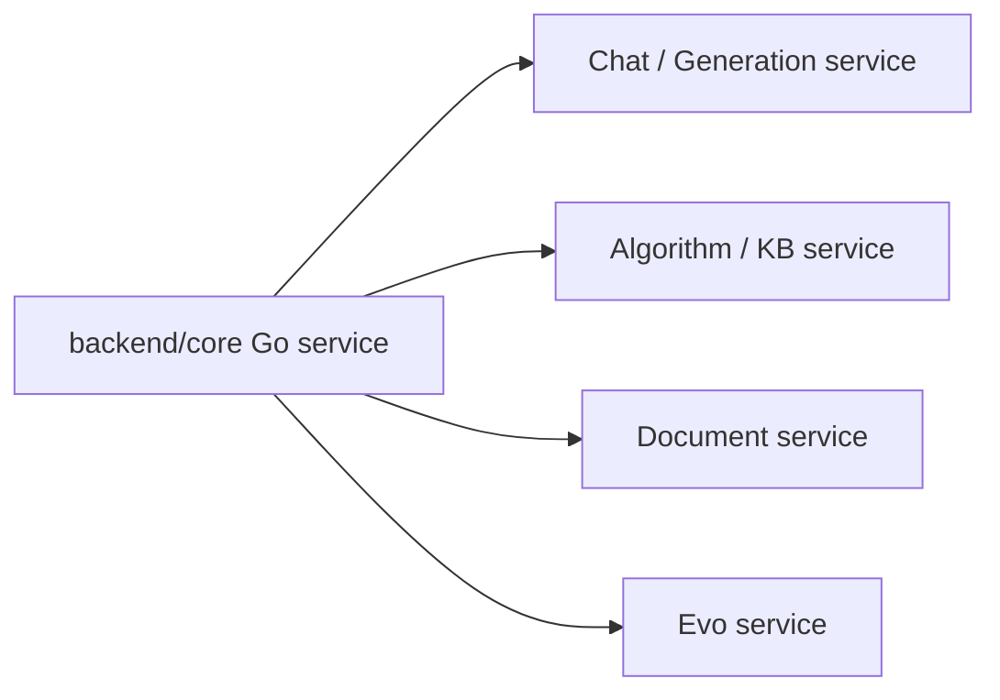

# Core 服务外部依赖扫描

生成日期: 2026-05-08

## 扫描范围

本次扫描以 Go 版 `backend/core` 服务为主，仅保留以下四类 Core 运行期外部服务:

- Chat / Generation 服务
- Algorithm / KB 服务
- Document 服务
- Evo Service

主要证据文件:

- `backend/core/common/external_endpoints.go`
- `backend/core/doc/*.go`
- `backend/core/chat/*.go`
- `backend/core/agent/*.go`
- `backend/core/modelprovider/check.go`
- `backend/core/algo/generate_client.go`
- `backend/core/wordgroup/*.go`
- `docker-compose.yml`

## 总览

| 外部服务 | 配置项 | 代码默认值 | docker-compose 默认值 | 主要用途 |
| --- | --- | --- | --- | --- |
| Chat / Generation 服务 | `LAZYMIND_CHAT_SERVICE_URL` | `http://chat:8046` | `http://chat:8046` | 对话、流式对话、技能/记忆/偏好生成、模型连通性检查 |
| Algorithm / KB 服务 | `LAZYMIND_ALGO_SERVICE_URL` | `http://10.119.24.129:8850` | `http://lazyllm-doc-server:8000` | 算法列表、算法分组、KB 创建/更新/删除、chunk 查询 |
| Document 服务 | `LAZYMIND_DOCUMENT_SERVICE_URL` | 回退到 `LAZYMIND_ALGO_SERVICE_URL` | `http://lazyllm-doc-server:8000` | 文档 add/reparse/transfer/delete、任务取消 |
| Evo Service | `LAZYMIND_EVO_SERVICE_URL` | `http://host.docker.internal:8048` | `http://evo-api:8047` | Agent 线程、自进化流程、结果、报告和 diff 代理 |

## 服务明细

### 1. Chat / Generation 服务

基础 URL 来自 `LAZYMIND_CHAT_SERVICE_URL`，代码默认 `http://chat:8046`。

Core 调用的端点:

| 方法 | 路径 | 用途 | 触发模块 |
| --- | --- | --- | --- |
| POST | `/api/chat` | 非流式问答 | `chat/conversation_logic.go`, `chat/chat.go` |
| POST | `/api/chat/stream` | 流式问答 | `chat/chat.go`, `chat/conversation_logic.go` |
| POST | `/api/chat/llm_generate` | 按 `task_type` 生成技能、记忆、用户偏好或润色 prompt | `algo/generate_client.go`, `skill/management.go`, `memory/handler.go`, `preference/handler.go` |
| POST | `/api/model/check` | 校验模型 provider/group 的连通性 | `modelprovider/check.go` |

### 2. Algorithm / KB 服务

基础 URL 来自 `LAZYMIND_ALGO_SERVICE_URL`，代码默认 `http://10.119.24.129:8850`。在 docker-compose 中 core 将其配置为 `http://lazyllm-doc-server:8000`。

Core 调用的端点:

| 方法 | 路径 | 用途 | 触发模块 |
| --- | --- | --- | --- |
| GET | `/v1/algo/list` | 获取算法列表（返回 `{items: [...]}`） | `doc/dataset.go` |
| GET | `/v1/algo/{algo_id}/groups` | 获取算法 parser/group 信息 | `doc/dataset.go`, `doc/segment.go` |
| POST | `/v1/kbs` | 创建 KB | `doc/dataset.go` |
| DELETE | `/v1/kbs/{kb_id}` | 删除 KB | `doc/dataset.go` |
| POST | `/v1/kbs/{kb_id}` | 更新 KB 元信息 | `doc/dataset.go` |
| GET | `/v1/chunks` | 查询文档分段/chunk | `doc/segment.go` |

### 3. Document 服务

文档服务基础 URL 优先来自 `LAZYMIND_DOCUMENT_SERVICE_URL`，未配置时回退到 `LAZYMIND_ALGO_SERVICE_URL`。

Core 调用的端点:

| 方法 | 路径 | 用途 | 触发模块 |
| --- | --- | --- | --- |
| POST | `/v1/docs/add` | 添加待解析文档 | `doc/task_external.go`, `doc/task.go` |
| POST | `/v1/docs/reparse` | 重新解析文档 | `doc/task_external.go`, `doc/task.go` |
| POST | `/v1/docs/transfer` | 文档复制/移动/转移 | `doc/task_external.go`, `doc/task.go` |
| POST | `/v1/docs/delete` | 删除外部文档 | `doc/document.go` |
| POST | `/v1/tasks/cancel` | 取消外部任务 | `doc/task_external.go`, `doc/task.go` |

docker-compose 中:

```yaml
LAZYMIND_DOCUMENT_SERVICE_URL: ${LAZYMIND_DOCUMENT_SERVICE_URL:-http://lazyllm-doc-server:8000}
```

### 4. Evo Service

基础 URL 来自 `LAZYMIND_EVO_SERVICE_URL`，代码默认 `http://host.docker.internal:8048`，docker-compose 默认 `http://evo-api:8047`。

Core 调用的端点:

| 方法 | 路径 | 用途 | 触发模块 |
| --- | --- | --- | --- |
| POST | `/v1/evo/threads` | 创建 agent/evo 线程 | `agent/handlers.go` |
| GET | `/v1/evo/threads/statuses` | 批量查询线程状态 | `agent/helpers.go`, `agent/handlers.go` |
| POST | `/v1/evo/threads/{thread_id}/messages` | 消息 SSE 流 | `agent/messages.go` |
| GET | `/v1/evo/threads/{thread_id}/events` | 事件 SSE 流 | `agent/handlers.go` |
| GET | `/v1/evo/threads/{thread_id}/flow-status` | 查询流程状态 | `agent/handlers.go`, `agent/rounds.go` |
| POST | `/v1/evo/threads/{thread_id}/start` | 启动线程 | `agent/handlers.go` |
| POST | `/v1/evo/threads/{thread_id}/pause` | 暂停线程 | `agent/handlers.go` |
| POST | `/v1/evo/threads/{thread_id}/cancel` | 取消线程 | `agent/handlers.go`, `agent/rounds.go` |
| POST | `/v1/evo/threads/{thread_id}/retry` | 重试线程 | `agent/handlers.go` |
| GET | `/v1/evo/threads/{thread_id}/results/{kind}` | 查询 datasets、eval-reports、analysis-reports、diffs、abtests | `agent/handlers.go` |
| GET | `/v1/evo/reports/{report_id}/content` | 获取报告内容 | `agent/handlers.go` |
| GET | `/v1/evo/diffs/{apply_id}/{filename}` | 获取 diff 内容 | `agent/handlers.go` |

注意: 批量状态端点路径为 `/v1/evo/threads/statuses`。

## 运行期依赖关系简图


