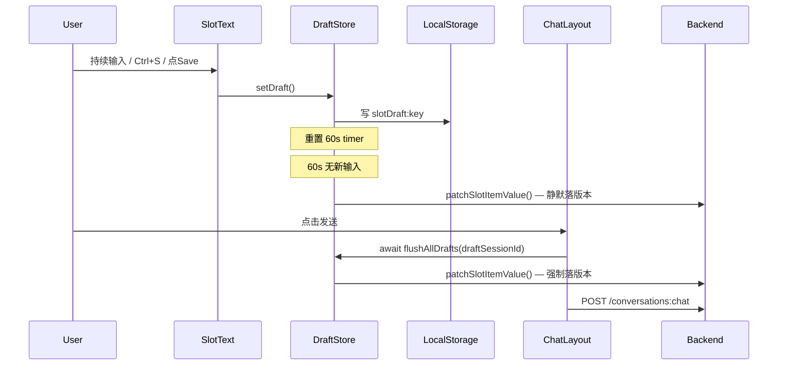
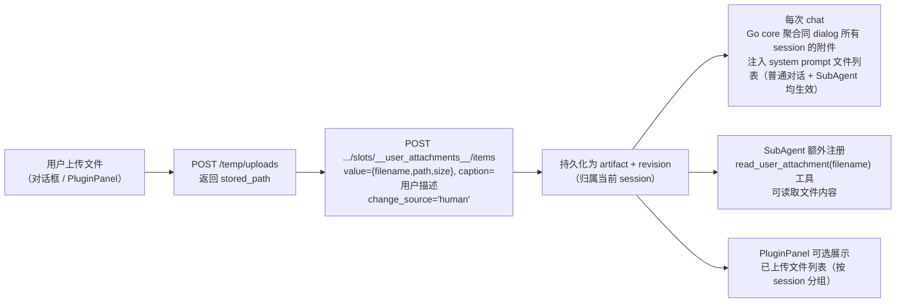

# 人工编辑附件能力方案

## 背景

现有基础（Phase 3 已落地）：
- `SlotText` 有 textarea 编辑态，`Save` 按钮直接调 `patchSlotItemValue` → 后端立即写新 `human` revision（本方案将改掉这个行为）
- `sub_agent_artifacts.caption` 字段已有，但无前端编辑入口
- `plugin_slot_order` 乐观锁调序已实现
- `chatLayout` 发送时不感知 `PluginPanel` 内部编辑状态

> **实施进展（截至 2026-06-23）**：能力一（后端 POST items）、能力二（draftStore + SlotText 改造 + flushAllDrafts）、能力三（caption API + SlotText/SlotImage caption UI）已落地。大文件 flush 路径、SlotFile caption 编辑、能力四（`__user_attachments__` slot 持久化）尚未实现。

---

## 能力一：人工创建/上传新内容 ✅

**后端新增 API**（[`backend/core/plugin/handlers.go`](backend/core/plugin/handlers.go)）

```
POST /api/core/plugin-sessions/{session_id}/slots/{slot_id}/items
Body: { value: {...}, caption?: string, insert_before?: number }
```

- `insert_before` 省略 → 追加到末尾
- `insert_before = N` → 插入到第 N 位之前，`order_list` 更新顺序，`list_index` 不变（稳定身份）
- 调用 `WriteSlotRevisionWithSnapshot`，`change_source = 'human'`
- 图片/文件类型：前端先 `POST /api/core/temp/uploads` 上传，拿到 `stored_path`，再填入 `value.path`

**前端 UI**（[`SlotComponents.tsx`](frontend/src/modules/chat/components/PluginPanel/SlotComponents.tsx)）

- list slot 底部增加 `+` 按钮
- 点击后弹出 Modal：文字 slot 输入文本，图片/文件 slot 上传文件，可选填 caption
- 提交调用 `createSlotItem(sessionId, slotId, value, caption?, insertBefore?)` store 方法

---

## 能力二：文字编辑的草稿与版本控制 ✅

### 核心设计：两层存储

| 层 | 存储位置 | 触发条件 | 作用 |
|---|---|---|---|
| 草稿层 | `localStorage` | onChange / Ctrl+S / Save按钮 / 关闭编辑态 | 防丢失，页面崩溃可静默恢复 |
| 版本层 | 后端 `plugin_slot_revisions` | 60s 无新输入 / Chat 发送 | 产生正式版本记录 |

**Save 按钮 / Ctrl+S / 关闭编辑态 三者行为完全一致**：只写 localStorage，不产生后端版本。

**版本触发条件（仅两个）**：
- 60s 无新输入（debounce 自动，用户停止编辑后静默落版本）
- Chat 发送前（`flushAllDrafts`，强制 flush 所有 pending 草稿）

### draftStore 设计 ✅

新增到 [`frontend/src/modules/chat/store/pluginPanel.ts`](frontend/src/modules/chat/store/pluginPanel.ts)（作为**模块级私有状态**，不在 zustand store 内，确保 Map 引用稳定不触发重渲染）：

```typescript
interface DraftEntry {
  value: Record<string, unknown>;
  timer: ReturnType<typeof setTimeout> | null;
}
// key = `${sessionId}:${slotId}:${sortOrder}`
drafts: Map<string, DraftEntry>
```

四个方法（另有 `getLocalDraft` 供 mount 时静默恢复读取）：

- `setDraft(sessionId, slotId, sortOrder, value)` — 写 localStorage（`slotDraft:${key}`）+ 更新内存草稿 + 重置 60s timer
- `flushDraft(sessionId, slotId, sortOrder)` — 清 timer，调 `patchSlotItemValue`，产生 human revision，**不**清除 localStorage（localStorage 在 `setDraft` 时维护，版本落盘不清除）
- `flushAllDrafts(sessionId)` — 遍历所有 `sessionId:` 前缀的条目，并行 `flushDraft`，返回 `Promise<void>`
- `cancelDraft(sessionId, slotId, sortOrder)` — 清 timer，清除 localStorage，丢弃草稿，不产生版本
- `getLocalDraft(sessionId, slotId, sortOrder)` — 读 localStorage，用于 mount 时静默恢复

### SlotText 改造 ✅

- **mount 时**：读取 `localStorage.getItem('slotDraft:...')`，若草稿与当前 `artifact_value` 内容不同则**静默替换**显示内容，不弹提示，不自动进入编辑态；若草稿与当前内容相同则调 `cancelDraft` 丢弃（避免积累无效草稿）
- **onChange**：调 `setDraft`（不再直接调 `patchSlotItemValue`）
- **Ctrl+S / Save 按钮 / 关闭编辑态**（含 onBlur）：调 `handleSave` → `setDraft`，只写 localStorage，不产生版本；内容无变化则调 `cancelDraft`
- **Cancel 按钮**：调 `cancelDraft`，恢复到 `artifact_value` 原始内容
- **图片/文件替换**：不经过 draftStore，上传完成直接调 `patchSlotItemValue`，立即产生新版本
- **SlotEditingContext**（新增）：文本 slot 进入/退出编辑态时通知父 `PluginPanel`，父级据此禁用 Continue/Retry 按钮

### chatLayout flushAllDrafts ✅

`chatLayout/index.tsx` 的 `onOpenSSE` 中在构造 SSE 请求前执行：

```typescript
// Draft key 用 plugin session_id（不是 conversation_id），需先取 activePluginSession
const activePluginSession = usePluginStore.getState().sessionByConversation[sessionId];
const draftSessionId = activePluginSession?.session_id ?? sessionId;
await draftStore.flushAllDrafts(draftSessionId);
```

> 注意：直接传 `conversationId` 会导致找不到任何草稿（draft key 前缀是 plugin `session_id`），已修复。

### 大文件文本的整体版本 ⚠️ 部分实现

大文本 artifact value 格式：`{"type":"text","path":"artifacts/xxx.txt","size":N}`。

- ✅ `SlotText` 检测到 `artifact_value.path`（`isOffloaded`）时，异步 `GET /api/core/static-files/{path}` 拉取完整内容展示
- ✅ 编辑时 draft 保存在 draftStore，key 同普通 text slot
- ❌ **TODO（large-file-flush）**：`flushDraft` 触发时，大文件应先 `POST /temp/uploads` 上传草稿内容为新文件，取回 `stored_path`，再 `PATCH items` 更新 `value.path`，产生 1 个 human revision。**当前实现直接传 `{ text: draft }`，未走上传文件流程**，大文件编辑 flush 路径不完整。

数据流：



---

## 能力三：编辑 caption（不产生新版本）✅

**后端 API**（[`backend/core/plugin/handlers.go`](backend/core/plugin/handlers.go)）

```
PATCH /api/core/plugin-sessions/{session_id}/slots/{slot_id}/items/{sort_order}/caption
Body: { caption: string }
```

逻辑：`SortOrderToListIndex` → 找 selected revision 的 `artifact_key` → `UPDATE sub_agent_artifacts SET caption=? WHERE artifact_key=?`。**不触碰 `plugin_slot_revisions`**。

**前端 UI**（[`SlotComponents.tsx`](frontend/src/modules/chat/components/PluginPanel/SlotComponents.tsx)）

- `SlotText` / `SlotImage` 卡片下方显示 caption（灰色小字），点击进入 inline 编辑态（单行 input）
- 失焦或按 Enter 立即调 `patchSlotCaption`，不经过 draftStore，立即落盘
- ❌ **TODO（slot-file-caption）**：`SlotFile` 的 caption 编辑尚未实现，与 SlotText/SlotImage 对齐后三种 slot 均支持

---

## 能力四：用户上传文件持久化（对话阶段）❌ TODO

> **当前状态**：用户上传文件仍走原有 temp 路径，通过 `artifact_refs` 传递给 SubAgent 上下文，但不会持久化到 session slot。本节描述的完整方案尚未实现。
>
> **已实现子项**：`read_user_attachment(filename)` 工具已在 `tools.py` 实现，但当前绑定的是当次请求 `agentic_config['files']`（临时文件），**不是** `__user_attachments__` slot 持久化路径，待 slot 机制落地后需对齐。

**问题**：对话中上传的文件目前只是 temp 路径传入 chat，没有持久化到 session，AI 后续对话（新 session）无法再次引用。

**方案**：dialog 级别的隐式 `__user_attachments__` list slot，普通对话与 SubAgent 均可感知文件，SubAgent 额外支持读取文件内容。



### 存储粒度

- `__user_attachments__` 是普通 slot（`slot_type='list'`），前端按 `slot_id` 前缀 `__` 过滤，不显示在 tab 中
- slot 归属于具体的 `plugin_session_id`，天然隔离不同轮次（session）的上传文件
- PluginPanel 展示时按 session 分组，保留历史可读性

### 注入策略：system prompt 层（普通对话 + SubAgent 均生效）

Go core 在 `buildChatRequestBody` 阶段（早于 `applyChatRuntimeConfigs`）新增注入逻辑：

1. 根据 `conversation_id` 查出同一 dialog 下所有 session 的 `__user_attachments__` slot 的 selected revisions
2. 将文件列表拼入 `system_prompt` 末尾的固定片段：

```
[用户已上传的文件]
- report.pdf (2 MB) — 上传于 2026-06-18
- data.xlsx (500 KB)
如需读取文件内容，请使用工具（仅 SubAgent 模式支持）。
```

3. 注入写入 `reqBody["user_attachments_context"]` 字段，Python chat 侧在拼 system prompt 时消费此字段
4. 文件列表只写入 system prompt，**不写入消息历史**，每次请求重建，历史消息保持干净

### SubAgent 工具扩展（SubAgent 独有）

Python `tools.py` 的 `read_user_attachment(filename)` 工具：

- **已实现**：工具本体已在 `tools.py` 中实现，已注册到 SubAgent 工具集（`_build_subagent_tools`）
- **当前行为**：从 `lazyllm.globals['agentic_config']['files']`（当次请求临时文件列表）匹配 filename，返回文件内容或路径
- **TODO**：待 `__user_attachments__` slot 持久化落地后，改为从 DB 查同 dialog 所有 session 的 `__user_attachments__`，不再依赖临时 files 列表

> `list_user_attachments` 工具不再单独提供——文件列表已通过 system prompt 注入，AI 无需主动调工具查询。

### 上传触发时机（❌ 未实现）

- 用户对话框上传文件后，在原有 `artifact_refs` 上传流程后追加一步 `POST items`
- 若当前 conversation 无活跃 session，Go core 自动为该 dialog 创建一个隐式 `__attachments_session__`，专门承载附件 slot

---

## 实施顺序

1. ✅ `draftStore` 核心逻辑（setDraft / flushDraft / flushAllDrafts / cancelDraft / getLocalDraft）
2. ✅ `SlotText` 改造（onChange/Ctrl+S/Save/关闭→setDraft，Cancel→cancelDraft，mount 静默恢复）
3. ✅ `chatLayout` 发送前 `await flushAllDrafts(plugin session_id)`
4. ✅ 后端 PATCH caption API
5. ✅ 前端 SlotText / SlotImage caption inline 编辑组件
6. ✅ 后端 POST items API（追加/insert_before）
7. ✅ 前端 + 按钮 + 创建 Modal（AddSlotItemButton）
8. ❌ 大文件 flushDraft 完整路径（先上传文件再 PATCH path）
9. ❌ `SlotFile` caption 编辑 UI
10. ❌ `__user_attachments__` slot 机制：
    a. Go core `buildChatRequestBody` 聚合同 dialog 所有 session 附件 → 注入 `user_attachments_context`
    b. Python chat 侧消费 `user_attachments_context`，拼入 system prompt
    c. `read_user_attachment` 工具改为从 DB `__user_attachments__` slot 查文件（当前读 `agentic_config['files']`）
    d. 前端上传文件后追加 `POST items` 到 `__user_attachments__` slot

## 需要修改的关键文件

- ✅ [`frontend/src/modules/chat/store/pluginPanel.ts`](frontend/src/modules/chat/store/pluginPanel.ts) — draftStore（含 localStorage）
- ✅ [`frontend/src/modules/chat/components/PluginPanel/SlotComponents.tsx`](frontend/src/modules/chat/components/PluginPanel/SlotComponents.tsx) — SlotText 改造 + caption UI（SlotText/SlotImage）+ AddSlotItemButton；SlotFile caption / 大文件 flush 路径待补
- ✅ [`frontend/src/modules/chat/pages/chatLayout/index.tsx`](frontend/src/modules/chat/pages/chatLayout/index.tsx) — flushAllDrafts（plugin session_id）；❌ 上传后关联 user_attachments 待实现
- ✅ [`backend/core/plugin/handlers.go`](backend/core/plugin/handlers.go) — PATCH caption、POST items 两个新 API
- ✅ [`backend/core/plugin/routes.go`](backend/core/plugin/routes.go) — 注册新路由
- ❌ [`backend/core/chat/conversation.go`](backend/core/chat/conversation.go) — `buildChatRequestBody` 聚合 dialog 内所有 session 的 `__user_attachments__`，注入 `user_attachments_context`
- ❌ [`algorithm/lazymind/chat/engine/chat.py`](algorithm/lazymind/chat/engine/chat.py)（或 system prompt 拼接处）— 消费 `user_attachments_context`，追加到 system prompt
- ⚠️ [`algorithm/lazymind/chat/engine/subagent/tools.py`](algorithm/lazymind/chat/engine/subagent/tools.py) — `read_user_attachment` 工具已实现，待 slot 机制落地后改为从 DB 查询
